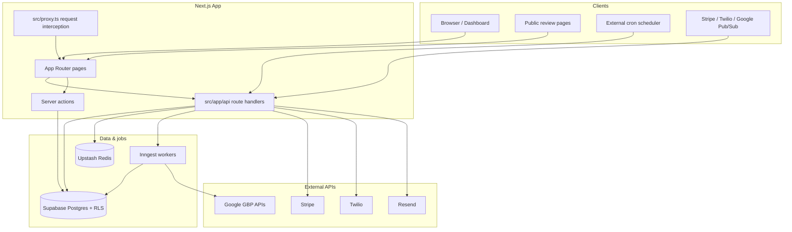

# Zyene Reviews

**Reputation management SaaS for local businesses and agencies.**  
Connect review platforms, sync and respond to reviews, run SMS/email campaigns, protect reputation with private feedback flows, and measure local SEO performance—all in one multi-tenant product.

This README is the **onboarding entry point** for engineers joining the team. It explains how we build, where code lives, and the rules we follow so changes stay safe at production scale. For deeper references, use the [documentation index](#documentation-index) below.

**AI agents:** [AGENTS.md](./AGENTS.md) is the master guide (code standards, SEO, skills, pre-flight checks). It is mirrored for each IDE below.

---

## AI-assisted development (all IDEs)

| IDE | Reads rules from | Reads skills from |
|-----|------------------|-------------------|
| **Cursor** | [AGENTS.md](./AGENTS.md), [.cursor/rules/](./.cursor/rules/) | [.agents/skills/](./.agents/skills/) |
| **GitHub Copilot** | [.github/copilot-instructions.md](./.github/copilot-instructions.md) | `.agents/skills/` |
| **Windsurf** | [.windsurf/rules/project.md](./.windsurf/rules/project.md) | [.windsurf/skills/](./.windsurf/skills/) |
| **Antigravity** | [.antigravity/rules.md](./.antigravity/rules.md) | `.agents/skills/` |
| **Claude Code** | [CLAUDE.md](./CLAUDE.md), [.claude/rules/](./.claude/rules/) | [.claude/skills/](./.claude/skills/) |

- **Canonical skills:** `.agents/skills/<name>/SKILL.md` — run `pnpm run skills:sync` after adding skills to update Claude/Windsurf symlinks.
- **Refresh Vercel skills:** `pnpm run skills:vercel`
- **Refresh Cursor rules (awesome-cursorrules):** `pnpm run cursorrules:install`

---

## Table of contents

1. [What we build](#what-we-build)
2. [Product surfaces](#product-surfaces)
3. [Tech stack](#tech-stack)
4. [Architecture at a glance](#architecture-at-a-glance)
5. [Domain model (mental model)](#domain-model-mental-model)
6. [Repository map](#repository-map)
7. [First-week onboarding checklist](#first-week-onboarding-checklist)
8. [Local development](#local-development)
9. [Environment variables](#environment-variables)
10. [Scripts & tooling](#scripts--tooling)
11. [Development workflow](#development-workflow)
12. [How we organize code](#how-we-organize-code)
13. [Multi-tenancy & security](#multi-tenancy--security)
14. [Database & migrations](#database--migrations)
15. [Background jobs, cron & webhooks](#background-jobs-cron--webhooks)
16. [Integrations](#integrations)
17. [Testing](#testing)
18. [Design system & UI](#design-system--ui)
19. [Observability & debugging](#observability--debugging)
20. [Deployment & production](#deployment--production)
21. [Documentation index](#documentation-index)
22. [Principles we follow](#principles-we-follow)

---

## What we build

Zyene Reviews helps location-based businesses:

- **Aggregate reviews** from Google Business Profile, Yelp, and Facebook into one inbox.
- **Analyze reviews** with AI (sentiment, urgency, themes, draft replies).
- **Request reviews** proactively via SMS (Twilio), email (Resend), campaigns, QR codes, and API/Zapier.
- **Protect reputation** with the Negative Feedback Shield (low ratings → private feedback instead of public platforms).
- **Track competitors** and local SEO signals (GBP performance, keywords, profile health).
- **Bill and collaborate** via Stripe subscriptions and business-scoped team roles.

The codebase is a **single Next.js application** backed by **Supabase Postgres** with strict **Row Level Security (RLS)** for tenant isolation.

---

## Product surfaces

| Surface | Route group | Who uses it |
|--------|-------------|-------------|
| Marketing site | `src/app/(marketing)` | Prospects, SEO, docs, free tools |
| Auth | `src/app/(auth)` | Sign up, login, password reset |
| Onboarding | `src/app/onboarding` | New orgs connecting Google / choosing plan |
| Dashboard | `src/app/(dashboard)` | Paying customers (reviews, campaigns, settings) |
| Public review flow | `src/app/r/[slug]` | End customers leaving feedback |
| Embeddable widget | `src/app/w/[slug]` | Business websites (carousel/badge) |
| API | `src/app/api` | Mobile, Zapier, cron, webhooks, internal jobs |
| Docs | `src/app/docs` | Developer API documentation |

**Active business context:** Logged-in users work inside one **business** (location) at a time. The active business is stored in an HTTP-only cookie and resolved server-side via `getActiveBusinessId()` in `src/lib/auth/business-context.ts`.

---

## Tech stack

| Layer | Technology | Role |
|-------|------------|------|
| App framework | **Next.js 16** (App Router) | SSR, routing, API routes, server actions |
| Language | **TypeScript** (strict) | End-to-end typing |
| UI | **React 19**, **Tailwind CSS 4**, **shadcn/ui** | Components and design system |
| Database & auth | **Supabase** (Postgres + Auth) | Data, RLS, sessions |
| Cache / rate limits | **Upstash Redis** | Business context cache, API rate limiting |
| Background jobs | **Inngest** | Review sync, campaigns, AI batches |
| Billing | **Stripe** | Subscriptions, webhooks, entitlements |
| Email | **Resend** | Transactional + team invites |
| SMS | **Twilio** | Review requests and alerts |
| AI | **Google GenAI** | Review analysis, drafts, insights |
| Observability | **Sentry** | Errors and performance |
| Hosting | **Vercel** (typical) | Production deployments |
| Package manager | **pnpm** | Only lockfile: `pnpm-lock.yaml` |

---

## Architecture at a glance



**Request path (simplified):**

1. Browser hits Next.js → `src/proxy.ts` may handle auth subdomain routing, session refresh, CORS.
2. Server Components / route handlers use `createClient()` from `src/lib/db/supabase/server.ts` (user-scoped, RLS applies).
3. Privileged paths (cron, some webhooks) use `createAdminClient()` from `src/lib/db/supabase/admin.ts`—use sparingly and never from the browser.
4. Long-running or retriable work is **queued to Inngest** rather than blocking HTTP requests.

---

## Domain model (mental model)

Think in this hierarchy—almost every feature maps here:

```
Organization (tenant, billing, plan)
  └── Business (single location / GBP listing)
        ├── review_platforms (Google / Yelp / Facebook connections)
        ├── reviews, private_feedback
        ├── review_requests, campaigns, customers
        ├── competitors, competitor_snapshots, insights
        └── team: business_members, invitations
```

| Entity | Table(s) | Notes |
|--------|----------|--------|
| Organization | `organizations` | Stripe customer, plan, limits |
| Business | `businesses` | Slug, branding, auto-reply settings |
| User | `users` + Supabase Auth | Profile; linked via `organization_members` / `business_members` |
| Review | `reviews` | Unified across platforms; AI fields on row |
| Review request | `review_requests` | Lifecycle: queued → sent → opened → completed |
| Platform connection | `review_platforms` | OAuth tokens (encrypted at rest) |

Full schema narrative: [`docs/PROJECT_DEEP_DIVE.md`](docs/PROJECT_DEEP_DIVE.md).

---

## Repository map

```text
zyene-reviews/
├── src/
│   ├── app/                 # Next.js routes ONLY (pages, layouts, API, actions)
│   │   ├── (auth)/          # Login, signup, password reset
│   │   ├── (dashboard)/     # Authenticated product
│   │   ├── (marketing)/     # Marketing + legal + tools
│   │   ├── api/             # Route handlers (REST-style)
│   │   ├── actions/         # Server actions (mutations)
│   │   ├── onboarding/
│   │   ├── r/[slug]/        # Public review capture flow
│   │   └── w/[slug]/        # Embeddable widget
│   ├── components/          # React UI (feature folders + ui/ primitives)
│   ├── services/            # External APIs (Google, Stripe, Twilio, Inngest, …)
│   ├── lib/                 # Internal logic (auth, db wrappers, validation, utils)
│   ├── hooks/               # Shared React hooks
│   ├── types/               # Shared TypeScript types
│   ├── constants/           # Static config maps
│   └── proxy.ts             # Request interception (auth routing, session)
├── supabase/
│   └── migrations/          # SQL migrations (source of truth for schema)
├── tests/
│   ├── unit/                # Vitest unit tests
│   └── visual/              # Playwright visual tests
├── scripts/                 # Maintenance & verification scripts
├── docs/                    # Human + engineering documentation
├── public/                  # Static assets
├── .github/workflows/       # CI (typecheck, colors, test, build)
├── .env.example             # Environment template (copy to .env.local)
└── package.json
```

**Placement rules** (enforce on every PR):

| Put this… | Here… | Not here… |
|-----------|--------|-----------|
| Page / layout / `route.ts` | `src/app` | `src/components` |
| Google/Stripe/Twilio calls | `src/services` | `src/lib`, UI components |
| Auth helpers, DB clients | `src/lib` | `src/services` |
| shadcn primitives | `src/components/ui` | feature folders |
| Feature UI | `src/components/<feature>` | root of `components` |

Details: [`docs/CODEBASE_STRUCTURE.md`](docs/CODEBASE_STRUCTURE.md).

---

## First-week onboarding checklist

Use this as a structured ramp—most teams complete it in 3–5 days.

### Day 1 — Access & run locally

- [ ] GitHub access to this repository
- [ ] Supabase project access (read staging docs from team lead—**never commit secrets**)
- [ ] Stripe test mode dashboard (if touching billing)
- [ ] Copy `.env.example` → `.env.local` and fill required keys with team-provided staging values
- [ ] `pnpm install` && `pnpm dev` → app at `http://localhost:3000`
- [ ] Log in with a staging account; switch businesses in the header switcher
- [ ] Read this README end-to-end

### Day 2 — Architecture & data

- [ ] Read [`docs/PROJECT_DEEP_DIVE.md`](docs/PROJECT_DEEP_DIVE.md) (sections 1–6)
- [ ] Skim [`supabase/migrations/README.md`](supabase/migrations/README.md)
- [ ] Trace one flow: **Google OAuth connect** → token stored → review sync (Inngest)
- [ ] Trace one flow: **public review** `r/[slug]` → rating → redirect or private feedback

### Day 3 — Code conventions

- [ ] Read [How we organize code](#how-we-organize-code) and [Multi-tenancy & security](#multi-tenancy--security)
- [ ] Read `.github/copilot-instructions.md` (canonical rules for AI + humans)
- [ ] Run `pnpm typecheck`, `pnpm test`, `pnpm run check:colors`, `pnpm build` locally
- [ ] Pick a small bug; open a PR following [Development workflow](#development-workflow)

### Day 4–5 — Ship something small

- [ ] Fix or improve something in an area your team owns (reviews, campaigns, settings, etc.)
- [ ] Add or update a unit test if you touch shared helpers
- [ ] Walk through [`docs/PRODUCTION_CHECKLIST.md`](docs/PRODUCTION_CHECKLIST.md) for anything touching auth, webhooks, or billing

---

## Local development

### Prerequisites

- **Node.js 20** (matches CI)
- **pnpm 10** (`packageManager` field in `package.json` pins the version—use Corepack: `corepack enable`)
- **Supabase CLI** (optional, for local DB reset / migrations)
- Access to shared **staging credentials** (ask your team lead—do not use production keys locally)

### Setup

```bash
# 1. Install dependencies
pnpm install

# 2. Environment
cp .env.example .env.local
# Fill values in .env.local (see Environment variables)

# 3. Start dev server (Turbopack)
pnpm dev
```

Open [http://localhost:3000](http://localhost:3000). Marketing home is `/`; dashboard routes require auth.

### Common issues

| Problem | What to check |
|---------|----------------|
| Auth redirect loops | `NEXT_PUBLIC_ROOT_DOMAIN`, cookie domain, Supabase redirect URLs |
| “Redis required” in prod-like mode | `UPSTASH_REDIS_REST_URL` / `TOKEN` in `.env.local` |
| Google connect fails | `GOOGLE_CLIENT_ID`, `GOOGLE_CLIENT_SECRET`, redirect URI in Google Cloud console |
| Inngest jobs not running locally | Inngest dev server / `INNGEST_*` keys; see `.env.example` comments |
| Email rate limits | Configure custom SMTP in Supabase Auth or use Resend for app email |

Troubleshooting guides: `.agent/docs/GOOGLE_SYNC_TROUBLESHOOTING.md`. Historical integration checklist: `docs/archive/INTEGRATION_VERIFICATION.md`.

---

## Environment variables

**Never commit** `.env`, `.env.local`, or secrets in SQL migrations.

Copy [`.env.example`](.env.example) to `.env.local`. Variables are grouped there by domain:

| Group | Purpose |
|-------|---------|
| Supabase | DB URL, anon key, service role (server only) |
| App domains | `NEXT_PUBLIC_APP_URL`, `NEXT_PUBLIC_ROOT_DOMAIN` |
| Google | OAuth, Maps/Places, Pub/Sub verification |
| Stripe | Keys, price IDs, webhook secret |
| Twilio / Resend | Messaging and transactional email |
| Inngest | Event key, signing key, serve host |
| Upstash | Redis for cache + rate limits |
| Cron | `CRON_SECRET` for `/api/cron/*` routes |
| Sentry / analytics | Optional observability |

`NEXT_PUBLIC_*` variables are exposed to the browser—**never** put secrets there.

For production, secrets live in the hosting provider (e.g. Vercel) environment settings, not in git.

---

## Scripts & tooling

| Command | Purpose |
|---------|---------|
| `pnpm dev` | Local development server |
| `pnpm build` | Production build (required in CI) |
| `pnpm start` | Run production build locally |
| `pnpm typecheck` | `tsc --noEmit` — run before every PR |
| `pnpm test` | Vitest unit tests (`tests/unit`) |
| `pnpm lint` | ESLint |
| `pnpm run check:colors` | Enforce semantic colors (no raw palette utilities in most files) |
| `pnpm test:visual` | Playwright visual regression (optional locally) |

**Maintenance scripts** (see `scripts/` and `package.json`):

- `pnpm run verify:critical-flows` — critical path smoke checks
- `pnpm email:test` — send test emails via Resend (needs `.env.local`)

**Agent / internal docs** live under `.agent/docs/` (live onboarding + troubleshooting). Historical snapshots live under `docs/archive/`. Planned work: `docs/ROADMAP.md`.

---

## Development workflow

We follow a **trunk-based** style on `main`:

1. **Branch** from latest `main`: `feat/short-description` or `fix/short-description`.
2. **Small PRs** — easier review, safer deploys.
3. **CI must pass** before merge (see below).
4. **Code review** — at least one approval from someone familiar with the area.
5. **Merge to `main`** — deploys to production per team release process.

### CI pipeline (`.github/workflows/ci.yml`)

Every push/PR to `main` runs:

1. `pnpm install --frozen-lockfile`
2. `pnpm typecheck`
3. `pnpm run check:colors`
4. `pnpm test`
5. `pnpm build`

**Do not merge** if any step fails. Fix forward on the same branch.

### PR checklist (copy into your PR description)

- [ ] Scoped to one concern (feature, fix, or refactor)
- [ ] `pnpm typecheck && pnpm test && pnpm run check:colors && pnpm build` pass locally
- [ ] Tenant scoping preserved (`business_id` / `organization_id`)
- [ ] No secrets, no `.env` files, no debug logging of tokens
- [ ] Migrations included if schema changed (new timestamped file only)
- [ ] Screenshots for UI changes (light + dark if applicable)

---

## How we organize code

### Layering

```
UI (components)  →  calls  →  app routes / server actions
                              ↓
                         lib (orchestration, validation, auth)
                              ↓
                         services (external providers)
                              ↓
                         Supabase / Redis / Inngest
```

- **Do not** call Stripe, Google, or Twilio from React components.
- **Do** validate mutations with **Zod** at API/action boundaries.
- **Do** use shared API helpers under `src/app/api/_shared` for consistent `apiOk` / `apiError` responses.

### Server vs client components

- Default to **React Server Components** in `src/app`.
- Add `"use client"` only when you need browser state, effects, or event handlers.
- Load dashboard data in server loaders / `page.tsx` where possible; pass props to client islands.

### File size & decomposition

- Prefer **focused files** (~200 lines or less for new feature UI—split sections into `*-section.tsx`, `load-*-page-data.ts`).
- Co-locate route-specific logic next to the route: `load-reviews-page-data.ts` beside `page.tsx`.

### Naming

| Kind | Convention | Example |
|------|------------|---------|
| React component | `PascalCase.tsx` | `ReviewsPageClient.tsx` |
| Hook | `use*.ts` | `useCampaignDetail.ts` |
| Route handler | `route.ts` in folder | `api/reviews/route.ts` |
| Service module | `kebab-case.ts` | `sync-platform.ts` |

### Imports

Use path alias `@/` (maps to `src/`):

```ts
import { createClient } from "@/lib/db/supabase/server";
import { syncGoogleReviewsForPlatform } from "@/services/google/sync-service";
```

---

## Multi-tenancy & security

These rules are **non-negotiable**—they protect customer data and our compliance posture.

### Tenant isolation

- Scope **business data** by `business_id`.
- Scope **org-level** settings and billing by `organization_id`.
- RLS policies enforce access in Postgres; application code must still avoid logical leaks (e.g. wrong business in a query).
- Use helpers such as `userCanAccessBusiness()` / `verify-business-access` before privileged writes.
- **Never** trust client-supplied `business_id` when the server can derive it from session + cookie.

### Authentication

- Supabase Auth + SSR cookies via `@supabase/ssr`.
- `src/proxy.ts` handles protected routes, subdomain routing (auth vs app), session refresh.
- Active business: cookie `active_business_id`, set via `setActiveBusiness()` after server-side validation.

### Webhooks & cron

| Source | Verification |
|--------|----------------|
| Stripe | `stripe-signature` + webhook secret |
| Twilio | `x-twilio-signature` |
| Google Pub/Sub | Query token `GOOGLE_PUBSUB_VERIFICATION_TOKEN` |
| Cron routes | `Authorization: Bearer <CRON_SECRET>` |

Fail **closed** in production if secrets are missing on protected endpoints.

### Secrets & tokens

- OAuth tokens for Google live in `review_platforms` (encrypted)—**never** return them to the client.
- Service role key only on server in trusted contexts (cron, webhooks, Inngest).
- No secrets in git, screenshots, or logs.

### Input validation

- All mutating API routes and server actions: **Zod** schemas.
- Whitelist updatable fields—no blind spread of request body into DB updates.

More detail: `.github/copilot-instructions.md`, [`docs/PRODUCTION_CHECKLIST.md`](docs/PRODUCTION_CHECKLIST.md).

---

## Database & migrations

- **Source of truth:** SQL files in `supabase/migrations/`.
- Applied in **lexicographic order** by filename (use `YYYYMMDDHHMMSS_description.sql` for new migrations).
- **Never edit** a migration already applied to production—add a new file instead.
- **Never reorder** or delete applied migrations.

```bash
# Create a new migration (Supabase CLI)
supabase migration new add_my_feature

# Local reset (destructive)
supabase db reset

# See remote vs local status
supabase migration list
```

Read [`supabase/migrations/README.md`](supabase/migrations/README.md) before your first schema change.

Generated types (if used) are regenerated separately—do not hand-edit `database.types.ts` for schema changes.

---

## Background jobs, cron & webhooks

### Inngest (`src/services/inngest/`)

Used for:

- Google / Yelp / Facebook **review sync**
- **Campaign** and follow-up sends
- **AI batch** review analysis
- Competitor watch and other long-running workflows

HTTP entry: `src/app/api/inngest/route.ts`.  
**Do not** set `INNGEST_DEV` on Vercel production.

### Cron (`src/app/api/cron/`)

External scheduler (e.g. cron-job.org) hits GET routes with `CRON_SECRET`:

- Sync reviews, follow-ups, digests, competitor watch, newsletter, etc.

See comments in `.env.example` for URL patterns.

### Webhooks (`src/app/api/webhooks/`)

- `stripe` — subscription lifecycle
- `twilio` — delivery status
- `google/pubsub` — GBP review notifications → Inngest fan-out
- `resend` — email events (Svix signature)

---

## Integrations

| Integration | Code location | Notes |
|-------------|---------------|--------|
| Google GBP | `src/services/google/` | OAuth, sync phases, performance, Q&A, lodging |
| Stripe | `src/services/stripe/` | Checkout, portal, plans, webhooks |
| Twilio | `src/services/twilio/` | SMS review requests |
| Resend | `src/services/resend/` | Email; templates in `src/services/resend/templates/` |
| Yelp | `src/services/yelp/` | Review sync |
| Facebook | `src/services/facebook/` | Review sync |
| AI | `src/services/ai/` | Analysis, insights, descriptions |

Plan entitlements: `src/services/stripe/plans.ts` — check before gating features.

---

## Testing

| Layer | Location | When to add |
|-------|----------|-------------|
| Unit | `tests/unit/*.test.ts` | Pure functions, parsers, access guards, API helpers |
| Visual | `tests/visual/` | Critical marketing/auth pages (Playwright) |
| Manual | Staging | OAuth, billing, SMS, end-to-end flows |

Run before PR:

```bash
pnpm typecheck
pnpm run check:colors
pnpm test
pnpm build
```

We optimize for **fast unit tests** on business logic; full E2E is selective due to OAuth/external deps.

---

## Design system & UI

- **Primitives:** `src/components/ui/` (shadcn/Radix).
- **Tokens:** CSS variables / semantic classes (`bg-background`, `text-muted-foreground`, `text-primary`, `text-chart-2`, etc.).
- **Color guard:** `pnpm run check:colors` blocks raw Tailwind palette utilities and most raw hex in TS/TSX (exceptions for canvas/PDF/OG renderers—see `scripts/check-color-guards.mjs`).
- **Design reference:** [`docs/DESIGN.md`](docs/DESIGN.md).

When building UI:

- Use existing patterns from neighboring components.
- Support **dark mode** (`next-themes`).
- Prefer `size-*` over matching `w-*` + `h-*` when dimensions are equal.
- Keep marketing and dashboard visually consistent with design tokens—not one-off hex in components.

---

## Observability & debugging

- **Sentry:** Errors and performance in production (`@sentry/nextjs`).
- **Logging:** `src/lib/logger` (structured; avoid logging PII/tokens).
- **Health check:** `GET /api/health` — used in deploy verification.

When debugging production issues:

1. Confirm Sentry issue + release.
2. Check Inngest run history for failed syncs/sends.
3. Verify Stripe webhook delivery for billing bugs.
4. For Google sync: `.agent/docs/GOOGLE_SYNC_TROUBLESHOOTING.md`.

---

## Deployment & production

Typical flow:

1. Merge to `main` → CI green → deploy to Vercel (or team pipeline).
2. Apply pending Supabase migrations to production (`supabase db push` per runbook).
3. Verify `GET /api/health`.
4. Smoke-test: login, reviews list, send test request (staging), Stripe webhook test event.

Pre-release checklist: [`docs/PRODUCTION_CHECKLIST.md`](docs/PRODUCTION_CHECKLIST.md).  
Critical flows: [`docs/CRITICAL_FLOW_VERIFICATION.md`](docs/CRITICAL_FLOW_VERIFICATION.md).

---

## Documentation index

| Document | Audience | Contents |
|----------|----------|----------|
| **This README** | All engineers | Onboarding, conventions, workflow |
| [`docs/INDEX.md`](docs/INDEX.md) | All | Master doc map |
| [`docs/PROJECT_DEEP_DIVE.md`](docs/PROJECT_DEEP_DIVE.md) | Engineers | Architecture, schema, features |
| [`docs/CODEBASE_STRUCTURE.md`](docs/CODEBASE_STRUCTURE.md) | Engineers | Where to put new code |
| [`docs/DESIGN.md`](docs/DESIGN.md) | Design + FE | Visual system |
| [`docs/PLATFORM_FEATURES.md`](docs/PLATFORM_FEATURES.md) | PM + sales + eng | Customer-facing capabilities |
| [`docs/PRODUCTION_CHECKLIST.md`](docs/PRODUCTION_CHECKLIST.md) | Release owner | Deploy gates |
| [`docs/CRITICAL_FLOW_VERIFICATION.md`](docs/CRITICAL_FLOW_VERIFICATION.md) | QA + eng | Manual verification |
| [`supabase/migrations/README.md`](supabase/migrations/README.md) | Backend | Migration rules |
| [`.github/copilot-instructions.md`](.github/copilot-instructions.md) | Eng + AI tools | Canonical coding rules |
| `.agent/docs/*` | Internal | Live agent playbooks (onboarding, Google sync) |
| `docs/archive/*` | Internal | Historical architecture / verification snapshots |

---

## Principles we follow

How we aim to work—similar to mature SaaS engineering teams:

1. **Trunk-based delivery** — small PRs, green CI, frequent deploys.
2. **Security by default** — RLS + server validation + fail-closed webhooks.
3. **Clear boundaries** — `app` / `components` / `lib` / `services` are intentional, not suggestions.
4. **Fix forward** — especially for database schema; never rewrite history on `main`.
5. **No secrets in git** — ever.
6. **Optimize for the next engineer** — names, types, and docs matter as much as the feature.
7. **Test what breaks easily** — pure logic and guards get unit tests; OAuth flows get checklists.
8. **Product-aware engineering** — understand tenant impact before shipping a query change.

---

## Questions?

- **Product / scope:** Product or design lead.
- **Infra / deploy / secrets:** Engineering lead or DevOps contact.
- **Supabase / RLS:** Backend owner for the area you are changing.
- **Billing:** Owner of `src/services/stripe/` + webhook routes.

Ship safely, scope by `business_id`, and read `docs/PROJECT_DEEP_DIVE.md` before changing auth, billing, or sync.
