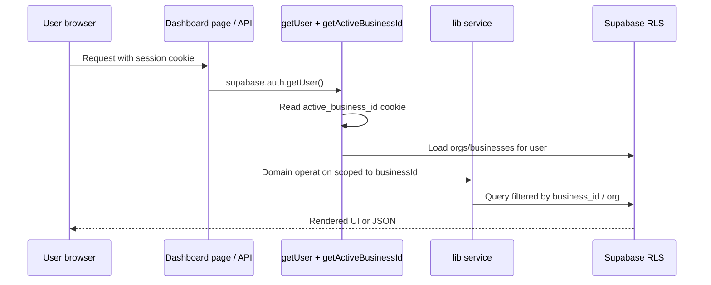
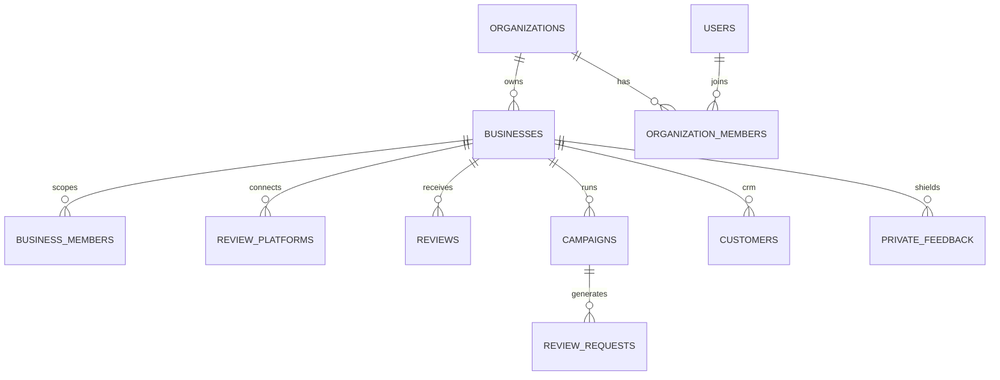

# Architecture

Deeper architecture reference for Zyene Reviews. Companion docs:

- Hub: [README.md](./README.md)
- Agent map: [../codebase-analysis-docs/CODEBASE_KNOWLEDGE.md](../codebase-analysis-docs/CODEBASE_KNOWLEDGE.md)
- Domain narrative: [PROJECT_DEEP_DIVE.md](./PROJECT_DEEP_DIVE.md)
- Placement rules: [CODEBASE_STRUCTURE.md](./CODEBASE_STRUCTURE.md)

---

## 1. Architectural style

The product is a **modular monolith**: one Next.js deployable that hosts marketing, auth, dashboard, public capture pages, and HTTP APIs.

Patterns in use:

| Pattern | Where it shows up |
|---------|-------------------|
| **App Router route groups** | `(marketing)`, `(auth)`, `(dashboard)`, `(onboarding)` |
| **Layered handlers** | `route.ts` / Server Actions → `src/lib/*` → `src/services/*` → Supabase / vendors |
| **Multi-tenant RLS** | Postgres policies + `business_id` / `organization_id` filters in app code |
| **Event-driven jobs** | Inngest functions for sync, campaigns, digests, growth mail |
| **Cron as HTTP** | `/api/cron/*` secured by `CRON_SECRET` (and some Vercel Cron headers) |
| **Webhook ingress** | `/api/webhooks/*` with provider-specific signature / token checks |

This is not a microservice mesh. Prefer extending existing layers over adding new deployables.

---

## 2. Main subsystems

### 2.1 Frontend surfaces

| Surface | Path | Notes |
|---------|------|-------|
| Marketing | `src/app/(marketing)/` | SEO-critical; metadata + sitemap |
| Auth UI | `src/app/(auth)/` | Login, signup, forgot/reset password |
| Onboarding | `src/app/onboarding/` | Org setup, Google connect, plan |
| Dashboard | `src/app/(dashboard)/` | Authenticated product UI |
| Review capture | `src/app/r/[slug]/` | collectratings.com public flow |
| Widget | `src/app/w/[slug]/` | Embeddable carousel/badge |
| Product docs | `src/app/docs/` | Developer-facing API docs UI |

Default to **React Server Components**. Add `"use client"` only for interactivity or browser APIs.

### 2.2 HTTP API

All under `src/app/api/`. Rough buckets:

- **Session APIs** — dashboard/client calls; use Supabase `getUser()` + active business cookie
- **Public developer API** — `/api/v1/*` via hashed API keys (`X-API-Key`)
- **Integrations** — OAuth connect/callback for Google, Facebook, Yelp, Square, Clover
- **Webhooks** — Stripe, Resend, Twilio, Google Pub/Sub, Square, Clover, generic
- **Cron** — digests, sync, AEO schedulers, competitor watch
- **Marketing / tools** — contact, newsletter, free tools, growth internals

Catalog: [API.md](./API.md).

### 2.3 Domain logic (`src/lib`)

Business rules, validations, feature flags, review-request senders, billing helpers, SEO helpers, Inngest client wiring under `src/lib/inngest`, etc.

### 2.4 Integration clients (`src/services`)

Thin-ish adapters to Google, Stripe, Twilio, Resend, Facebook, Yelp, Square, Clover, Inngest function registration, webhook processors.

### 2.5 Persistence

- **Supabase Postgres** — schema + RLS in `supabase/migrations/`
- **Generated types** — `src/lib/db/supabase/database.types.ts` (never hand-edit)
- Clients: `src/lib/db/supabase/server.ts` (user-scoped), `admin.ts` (service role)

### 2.6 Background work

| Mechanism | Entry | Role |
|-----------|-------|------|
| Inngest | `POST /api/inngest` + `src/lib/inngest` / `src/services/inngest` | Sync workers, campaigns, AI batches, growth sequences |
| Cron HTTP | `GET /api/cron/*` | Schedulers / heartbeats (cron-job.org or Vercel Cron) |
| Supabase webhook | `/api/webhooks/supabase/*` | DB-triggered fan-out (e.g. scheduled review requests) |

### 2.7 Cross-cutting

- **Auth / tenancy** — [AUTHENTICATION.md](./AUTHENTICATION.md)
- **Config** — [CONFIGURATION.md](./CONFIGURATION.md)
- **Observability** — Sentry (`instrumentation*.ts`), Pino server logger, Better Stack heartbeats
- **Rate limits / cache** — Upstash Redis

---

## 3. How subsystems talk

```mermaid
flowchart TB
  subgraph ingress [Ingress]
    Browser
    Zapier[Zapier / API clients]
    CronSched[Cron scheduler]
    Vendors[Stripe / Twilio / Google / Resend]
  end

  subgraph nextjs [Next.js process]
    Pages[App Router pages]
    Routes[API route handlers]
    Actions[Server Actions]
    Lib[src/lib domain]
    Services[src/services adapters]
    InngestServe[/api/inngest]
  end

  subgraph data [Data plane]
    PG[(Postgres + RLS)]
    Redis[(Upstash)]
  end

  subgraph async [Async]
    InngestCloud[Inngest Cloud]
  end

  Browser --> Pages
  Browser --> Routes
  Browser --> Actions
  Zapier --> Routes
  CronSched --> Routes
  Vendors --> Routes
  Pages --> Lib
  Routes --> Lib
  Actions --> Lib
  Lib --> Services
  Lib --> PG
  Lib --> Redis
  Services --> Vendors
  Routes --> InngestServe
  InngestServe --> InngestCloud
  InngestCloud -->|invoke functions| Lib
  Lib -->|inngest.send| InngestCloud
```

Communication summary:

| From → To | Mechanism |
|-----------|-----------|
| Browser → App | RSC + cookies (Supabase SSR session) |
| Browser → API | `fetch` / React Query; session cookies |
| External automation → API | `X-API-Key` on `/api/v1/*` |
| Cron → API | `Authorization: Bearer CRON_SECRET` |
| Vendors → API | Signed webhooks / verification tokens |
| App → Jobs | `inngest.send(...)` events |
| Jobs → App | Inngest calls `/api/inngest` with signing key |

---

## 4. Important request paths

### 4.1 Authenticated dashboard data



### 4.2 Public review capture (Negative Feedback Shield)

1. Customer opens `collectratings.com/r/{slug}` (or configured review-flow domain).
2. Selects rating.
3. **4–5 stars** → redirect to public platform (e.g. Google).
4. **1–3 stars** → private feedback form → `private_feedback` + alerts.

### 4.3 Review sync (Google)

Typical path: cron or Pub/Sub webhook → enqueue Inngest `review/sync.platform` → Google service fetches reviews → upsert `reviews` / update `review_platforms` → optional AI analysis pipeline.

### 4.4 Developer send review request

`POST /api/v1/requests/send` → API key auth + scope `review_requests:write` → `sendOutboundReviewRequest` → Twilio and/or Resend → `review_requests` row.

---

## 5. Domain / tenancy model



- **Organization** — billing tenant (Stripe), plan limits, agency vs business type.
- **Business** — location; primary scope for reviews, campaigns, integrations.
- **Active business** — HTTP-only cookie `active_business_id`, resolved by `getActiveBusinessId()` in `src/lib/auth/business-context.ts`.

Full field-level docs: [DATA_MODELS.md](./DATA_MODELS.md).

---

## 6. Design constraints (non-negotiable)

1. **`getUser()` for auth decisions** — never trust `getSession()` alone on the server.
2. **RLS on every new table** — tenant isolation is a security boundary.
3. **Zod on all API inputs** — body, query, params.
4. **No secrets in client** — only `NEXT_PUBLIC_*` for truly public values.
5. **File size limits** — pages ≤100, API routes ≤100, components ≤150, lib/services ≤200 lines (`pnpm check:sizes`).
6. **Do not hand-edit** `database.types.ts` or regenerate shadcn under `src/components/ui/` by hand-editing primitives.
7. **Prefer existing patterns** — see [CODING_CONVENTIONS.md](./CODING_CONVENTIONS.md) and [AGENTS.md](../AGENTS.md).

---

## 7. Deployment topology

- **Vercel** hosts the Next.js app (Node / Fluid Compute; not Edge for most product routes).
- **Supabase** hosts Postgres + Auth.
- **Inngest Cloud** runs durable functions; must reach `/api/inngest` (watch Deployment Protection bypass).
- **Upstash Redis** required in production-like environments.
- Dual brand domains: marketing/app vs collectratings review flow (`REVIEW_FLOW_DOMAIN` / related env).
