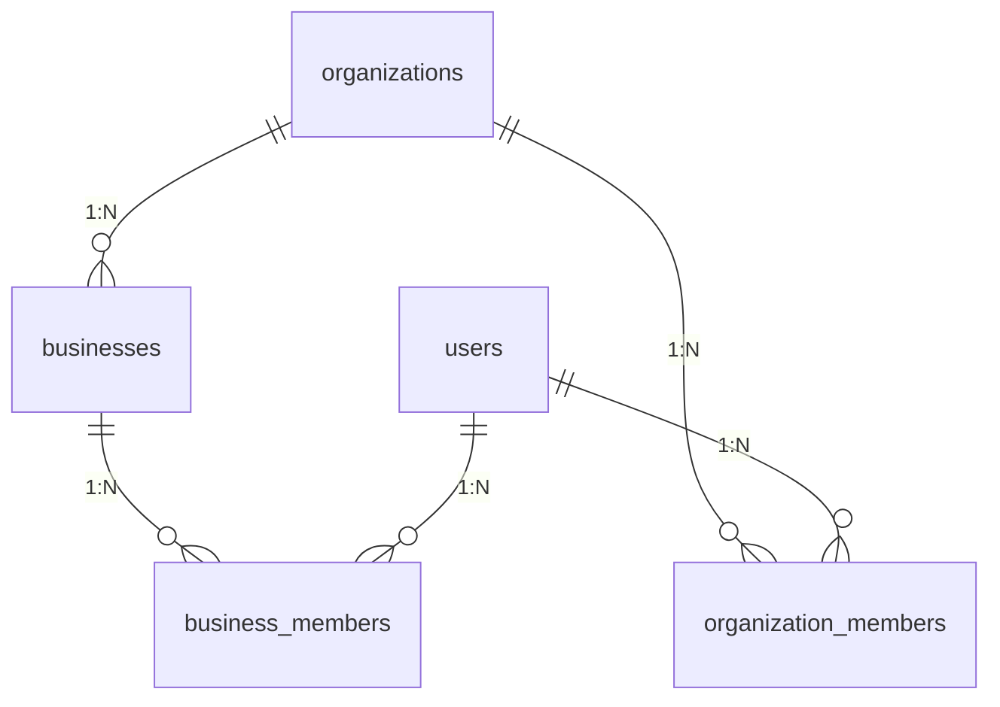

# Data Models

Primary persistence is **Supabase Postgres**. Schema evolves via `supabase/migrations/` (append new files; never edit already-applied migrations). Generated TypeScript types: `src/lib/db/supabase/database.types.ts` (**do not hand-edit**).

This document focuses on **core product entities**. Many AEO, competitor, growth, and POS spike tables exist — see migrations and [PROJECT_DEEP_DIVE.md](./PROJECT_DEEP_DIVE.md).

---

## 1. Tenancy hierarchy

### `organizations`

Billing and plan tenant.

| Field (core) | Type | Notes |
|--------------|------|-------|
| `id` | UUID PK | |
| `name` | string | |
| `slug` | string unique | |
| `type` | `business` \| `agency` | |
| `stripe_customer_id` / `stripe_subscription_id` | string? | |
| `plan` / `plan_status` | string | Limits evolved over migrations |
| `max_businesses`, `max_team_members`, `max_review_requests_per_month`, `max_ai_replies_per_month` | int | Entitlements |
| White-label fields | domain, logo, colors | Agency branding |

**Invariant:** Stripe customer is org-scoped (not per business).

### `users`

App profile row linked to `auth.users`.

| Field | Notes |
|-------|-------|
| `id` | = `auth.users.id` |
| `email`, `full_name`, `avatar_url`, `phone` | |
| `timezone` | default America/New_York |
| `onboarding_completed` | boolean |

### `organization_members`

| Field | Notes |
|-------|-------|
| `organization_id`, `user_id` | unique pair |
| `role` | `owner` \| `admin` \| `manager` \| `member` \| `viewer` |
| `status` | `active` \| `invited` \| `suspended` |

### `businesses`

Location / operational unit.

| Field (core) | Notes |
|--------------|-------|
| `organization_id` | FK parent org |
| `name`, `slug` | unique per org |
| Address / contact / category / timezone | |
| Review-request settings | delay, min amount, frequency cap, SMS/email flags |
| `total_reviews`, `average_rating` | cached metrics |
| `status` | e.g. active |

**Invariant:** Almost all product data hangs off `business_id`.

### `business_members`

Business-scoped team access (added after initial schema). Prefer checking both org role and business membership where UI is business-scoped.

---

## 2. Reviews and platforms

### `review_platforms`

| Field | Notes |
|-------|-------|
| `business_id` + `platform` | unique; `google` \| `yelp` \| `facebook` |
| `external_id` / `external_url` | vendor location ids |
| `access_token` / `refresh_token` | encrypted via vault RPCs in modern paths |
| `last_synced_at`, `sync_status` | |
| Cached `total_reviews`, `average_rating` | |

### `reviews`

| Field | Notes |
|-------|-------|
| `business_id`, `platform`, `external_id` | unique triple when external_id set |
| `rating` | 1–5 |
| `text`, author fields | |
| AI: `sentiment`, `urgency_score`, `themes[]`, `ai_summary` | |
| `response_status` | `pending` \| `draft_ready` \| `responded` \| `ignored` |
| `response_text`, `responded_at` | |
| `review_date` | |
| Visibility flags | e.g. `is_visible` (later migrations) |

**Invariant:** Sync upserts must be idempotent on platform external ids.

### `private_feedback`

Negative Feedback Shield storage for low public ratings diverted in-app.

Typical fields: business link, rating, free-text, category, status, customer contact, timestamps.

**Invariant:** Low-star path should not create a public Google review via the shield flow.

---

## 3. Campaigns and CRM

### `campaigns`

| Field | Notes |
|-------|-------|
| `business_id` | |
| `name`, `status` | active/paused/completed |
| `trigger_type` | manual / scheduled / pos_payment (POS may be locked in UI) |
| `channel` | sms / email / both |
| Templates | SMS + email subject/body |
| Counters | sent/opened/clicked/reviews received |

### `review_requests`

| Field | Notes |
|-------|-------|
| `business_id`, optional `campaign_id` | |
| Customer phone/email/name | |
| `trigger_source` | manual, campaign, zapier, pos_* , … |
| `channel`, `status` | queued → sent → delivered → opened → clicked → review_left / failed |
| `review_link`, timestamps, `error_message` | |
| `scheduled_for` | for delayed sends |

### `customers`

CRM contacts per business (see `20260304000000_create_customers_table.sql` and follow-ups). Support import/merge; respect `opt_outs`.

### `opt_outs`

Historically phone-global unique opt-out. **Assumption:** sending paths must check opt-outs before SMS.

### `invitations`

Pending team invites (email, role, token, expiry) — see audit/schema fix migrations.

---

## 4. Billing & API keys

| Entity | Role |
|--------|------|
| Org Stripe fields | Subscription source of truth (updated by webhook) |
| `stripe_webhook_events` | Idempotency for Stripe deliveries |
| API keys tables | Hashed keys, scopes, business binding (`src/lib/api-keys`) |
| `aeo_public_api_keys` / credit ledgers | AEO quota (feature area) |

---

## 5. Analytics & local SEO (selected)

| Table | Role |
|-------|------|
| `google_performance_metrics` | Daily GBP actions |
| `google_search_keyword_monthly` | Keyword impressions |
| `gbp_questions`, `gbp_place_action_links` | GBP Q&A / actions |
| `competitor_snapshots`, `competitor_events`, `competitor_insights`, `competitor_watch_runs` | Competitor watch |
| `google_seo_*` / `aeo_*` families | AI visibility, sampling, citations, crawls, reports |

---

## 6. Growth, NFC, POS spikes

| Table | Role |
|-------|------|
| `marketing_subscribers`, `growth_email_runs` | Newsletter / growth mail |
| `referral_conversions` | Referral rewards |
| `nfc_orders` | NFC card orders |
| `square_connections`, `square_payment_events` | Square sandbox |
| `clover_connections`, `clover_payment_events` | Clover sandbox |
| `business_milestones` | Gamified milestones |

---

## 7. Relationships summary

| Parent | Child | Cardinality |
|--------|-------|-------------|
| organization | businesses | 1:N |
| organization | organization_members | 1:N |
| business | review_platforms | 1:N (≤1 per platform type) |
| business | reviews | 1:N |
| business | campaigns | 1:N |
| campaign | review_requests | 1:N |
| business | review_requests | 1:N |
| business | customers | 1:N |
| business | private_feedback | 1:N |

---

## 8. Validation & invariants (app-level)

1. **Tenant isolation** — every mutating query must be scoped; RLS is necessary but not sufficient when using service role.
2. **Roles** — owners/admins manage billing and API keys; viewers are read-leaning.
3. **Rating bounds** — 1–5 on reviews; urgency 1–10 when set.
4. **Idempotent webhooks** — Stripe (and similar) store event ids before side effects.
5. **Token secrecy** — OAuth tokens encrypted via DB RPCs; never log raw tokens.
6. **Slug uniqueness** — per organization for businesses; org slugs globally unique.

For column-level truth after many migrations, prefer querying `database.types.ts` or `\d table` in Supabase over this summary alone.
