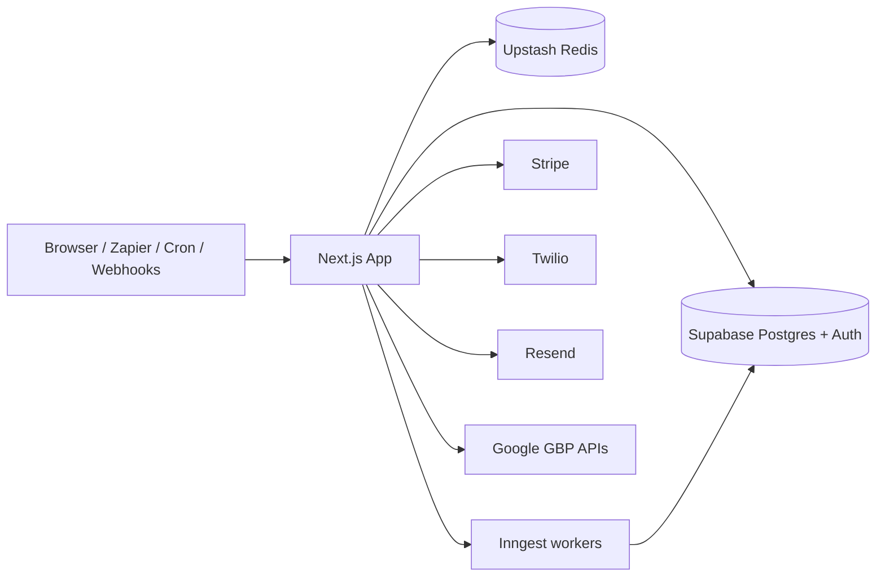

# Zyene Reviews — Documentation Hub

This folder is the **engineering knowledge base** for Zyene Reviews. Start here when onboarding, planning a change, or teaching an AI agent about the system.

For day-to-day setup and contributor workflow, the root [README.md](../README.md) remains the primary onboarding guide. For AI coding standards, see [AGENTS.md](../AGENTS.md).

---

## What this project is

**Zyene Reviews** is a multi-tenant SaaS reputation platform for local businesses and agencies. Customers:

- Connect Google Business Profile, Yelp, and Facebook
- Sync and reply to reviews (with AI draft help)
- Send SMS/email review requests and campaigns
- Route low ratings into private feedback (Negative Feedback Shield)
- Track competitors, GBP performance, and AEO/GEO signals
- Manage billing (Stripe) and team access per business/org

Two public domains:

| Domain | Role |
|--------|------|
| **zyenereviews.com** | Marketing, auth, dashboard (`app.zyenereviews.com`) |
| **collectratings.com** | Public review capture (`/r/[slug]`) |

---

## High-level architecture

Single **Next.js 16** App Router application:

- **UI** — React 19 Server Components + client islands (Tailwind 4, shadcn/ui)
- **API** — `src/app/api/**/route.ts` (Zod-validated; session or API key)
- **Data** — Supabase Postgres + Auth + RLS
- **Jobs** — Inngest event workers + cron HTTP routes
- **Cache / limits** — Upstash Redis
- **Billing / messaging** — Stripe, Twilio, Resend



Deeper diagrams and subsystem notes: [ARCHITECTURE.md](./ARCHITECTURE.md).  
Agent-oriented system map: [../codebase-analysis-docs/CODEBASE_KNOWLEDGE.md](../codebase-analysis-docs/CODEBASE_KNOWLEDGE.md).

---

## Tech stack

| Layer | Technology |
|-------|------------|
| App | Next.js 16, React 19, TypeScript (strict) |
| UI | Tailwind CSS 4, shadcn/ui, Radix |
| DB / Auth | Supabase (`@supabase/ssr`) |
| Jobs | Inngest |
| Cache | Upstash Redis |
| Billing | Stripe |
| Email / SMS | Resend, Twilio |
| AI | Google GenAI / Vertex |
| Tests | Vitest, Playwright (visual) |
| Hosting | Vercel |
| Package manager | **pnpm** only |

---

## Setup and installation

```bash
# Prerequisites: Node.js 20, pnpm 10 (corepack enable), optional Supabase CLI
pnpm install
cp .env.example .env.local
# Fill .env.local — see CONFIGURATION.md and .env.example comments
pnpm dev
```

Open [http://localhost:3000](http://localhost:3000). Full first-week checklist: [root README](../README.md#first-week-onboarding-checklist).

---

## Development and production

| Mode | Command |
|------|---------|
| Dev | `pnpm dev` |
| Typecheck + size guard | `pnpm verify:fast` |
| Full local verify | `pnpm verify` |
| Production build | `pnpm build` then `pnpm start` |
| Clean caches | `pnpm clean` |

Deployments typically follow merges to `main` on Vercel (project `zyene-reviews`). See root README § Deployment.

---

## Tests

| Command | Scope |
|---------|-------|
| `pnpm test` | All Vitest tests |
| `pnpm exec vitest run tests/unit/<file>.test.ts` | Single unit file (preferred after small edits) |
| `pnpm test:visual` | Playwright visual regression |
| `pnpm run verify:critical-flows` | Critical-path smoke script |

Default agent/post-task check: `pnpm verify:fast` + targeted Vitest — **not** a full `pnpm build` unless routes/config/APIs changed. Details: [CODING_CONVENTIONS.md](./CODING_CONVENTIONS.md).

---

## Configuration and environment

All env vars are documented in:

- [CONFIGURATION.md](./CONFIGURATION.md) — grouped reference + how config is loaded (`src/config/env.ts`)
- [`.env.example`](../.env.example) — canonical annotated template

Never commit `.env.local` or put secrets in SQL migrations.

---

## Common development tasks

| Task | How |
|------|-----|
| Run migrations | Apply via Supabase CLI / dashboard; never edit already-applied files — add a new migration under `supabase/migrations/` |
| Seed / staging data | Use shared staging credentials (team lead); no public seed script in-repo |
| Regenerate DB types | Supabase generate → `src/lib/db/supabase/database.types.ts` (**do not hand-edit**) |
| Sync agent skills | `pnpm run skills:sync` |
| Register cron helpers | `pnpm run cron:daily-digest`, `pnpm run cron:monthly-newsletter` |
| IndexNow ping | `pnpm run indexnow:ping` |

---

## Documentation map (this knowledge base)

| Doc | Purpose |
|-----|---------|
| [ARCHITECTURE.md](./ARCHITECTURE.md) | Subsystems, communication, Mermaid diagrams |
| [API.md](./API.md) | HTTP API catalog (public v1 + internal surfaces) |
| [DATA_MODELS.md](./DATA_MODELS.md) | Core entities, relationships, invariants |
| [PUBLIC_API.md](./PUBLIC_API.md) | Internal module “public” surfaces agents should reuse |
| [AUTHENTICATION.md](./AUTHENTICATION.md) | Sessions, OAuth, API keys, tenancy |
| [CONFIGURATION.md](./CONFIGURATION.md) | Env vars and config loading |
| [CODING_CONVENTIONS.md](./CODING_CONVENTIONS.md) | Naming, layering, testing expectations |
| [../codebase-analysis-docs/CODEBASE_KNOWLEDGE.md](../codebase-analysis-docs/CODEBASE_KNOWLEDGE.md) | Multi-level system knowledge + gotchas + doc TODOs |

### Related existing docs

- [INDEX.md](./INDEX.md) — full inventory (growth, GEO, audits, archives)
- [PROJECT_DEEP_DIVE.md](./PROJECT_DEEP_DIVE.md) — product/domain deep dive
- [CODEBASE_STRUCTURE.md](./CODEBASE_STRUCTURE.md) — placement rules
- [PLATFORM_FEATURES.md](./PLATFORM_FEATURES.md) — customer-facing capabilities
- [ROADMAP.md](./ROADMAP.md) — unbuilt work
- [DESIGN.md](./DESIGN.md) — design system SoT

---

## Keeping docs current

When you change core modules, auth, APIs, schema, or env vars: update the matching file above (or flag it in the PR). Cursor rule: [`.cursor/rules/documentation.mdc`](../.cursor/rules/documentation.mdc).
